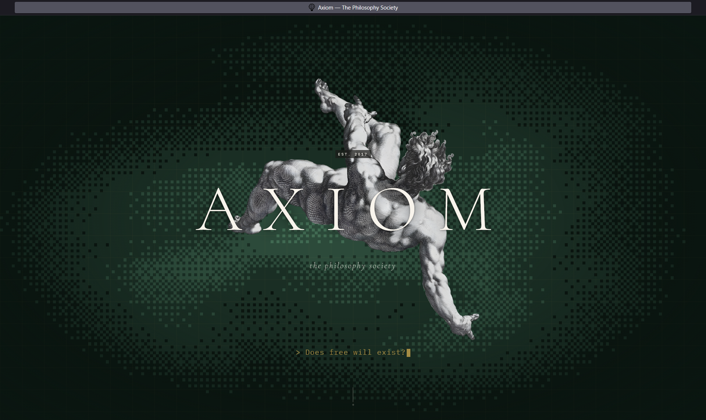
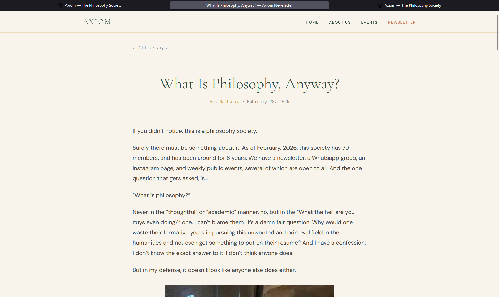
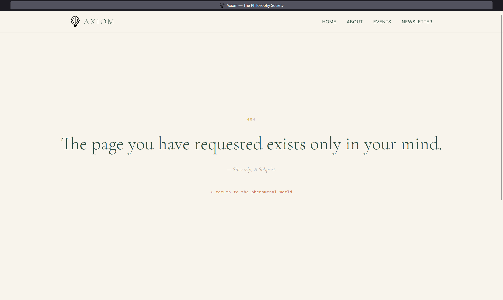

Website for Axiom, the philosophy society.

Built with React for main site UI design, ReactBits for components, and Eleventy for the newsletter blog.

Run locally using the `run.ps1` file.

Pull requests welcome. Encouraged, actually.

## Screenshots

| Home | Newsletter | 404 |
|------|------------|-----|
|  |  |  |

# future ideas/todos
## imp
collect the names and faces and quotes and socials of everyone in the society and rebuild the team page, but also add a link to the old team page. 
after that, add a section like https://zed.dev/ on the main page with everyone's face

also have events older than one year get archived in a separate section, and have a "recent events" section on the main page

## maybe later
use IBM font as main on newsletter, with georgia for headings. or just steal these fonts https://anytype.io/

ask gpt to hallucinate event descriptions and get images from https://drive.google.com/drive/folders/1-G3my0bNT35C-nrd7BWmGWjUDcww5SAI

ambitious: have a script that checks our socials for new posts or the drive link for new folders and automatically adds them to the event section