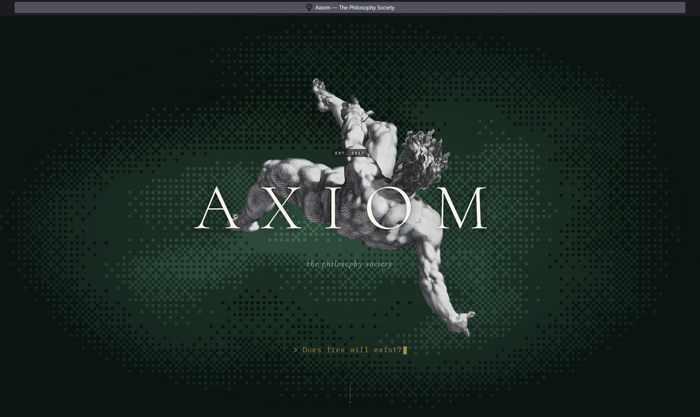
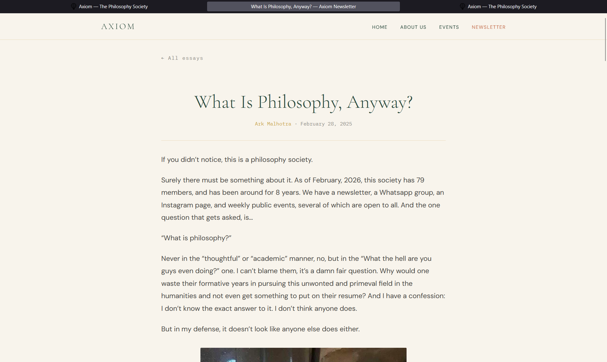
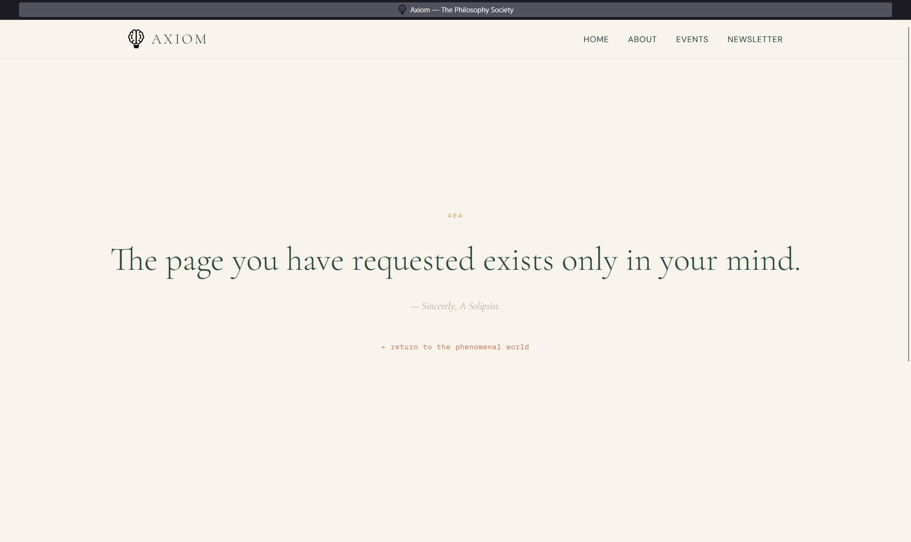

Website for Axiom, the philosophy society.

Built with React for main site UI design, ReactBits for components, and Eleventy for the newsletter blog.

Run locally using the `run.ps1` file.

Pull requests welcome. Encouraged, actually.

## Screenshots

| Home | Newsletter | 404 |
|------|------------|-----|
|  |  |  |